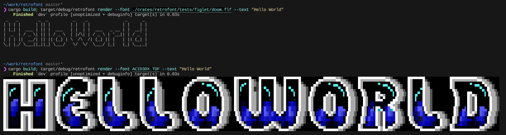

# retrofont

A Rust library and CLI toolkit for working with retro ASCII/ANSI art fonts, supporting both FIGlet and TheDraw (TDF) formats with full Unicode conversion and rendering capabilities.



## Features

- 🎨 **Multiple Font Formats**: Parse and render both FIGlet (.flf) and TheDraw (.tdf) fonts
- 🔄 **Format Conversion**: Convert between FIGlet and TDF formats with compatibility checking
- 🌍 **Unicode Support**: Automatic CP437 to Unicode conversion with proper character mapping
- 🎭 **Rendering Modes**: Display mode for final output, Edit mode for font development
- 📦 **Bundle Support**: Handle TDF files containing multiple fonts
- 🗜️ **Archive Support**: Load fonts from ZIP files
- 🎨 **Color Support**: Full 16-color DOS palette with authentic VGA RGB values
- 🔧 **Outline Styles**: 19 different outline rendering styles for outline fonts

## Installation

Add to your `Cargo.toml`:

```toml
[dependencies]
retrofont = "0.1"
```

For CLI usage:

```bash
cargo install retrofont-cli
```

### CLI Usage

```bash
# Render text with a FIGlet font
retrofont render --font fonts/doom.flf --text "HELLO WORLD"

# Render with a TDF font bundle (uses first font)
retrofont render --font fonts/ansi.tdf --text "Retro"

# Use edit mode to see font construction details
retrofont render --font fonts/block.tdf --text "Debug" --edit

# Render outline font with different styles (0-18)
retrofont render --font fonts/outline.tdf --text "Style" --outline 5

# Convert FIGlet to TDF
retrofont convert --input font.flf --output font.tdf --type block

# Convert with color support
retrofont convert --input font.flf --output font.tdf --type color

# Inspect font metadata
retrofont inspect --font fonts/bundle.tdf
```

## Font Formats

### FIGlet Fonts (.flf)

FIGlet (Frank, Ian & Glenn's letters) fonts are text-based ASCII art fonts:

- **Header**: Contains metadata like height, baseline, hard blank character
- **Character Set**: Supports ASCII printable range (32-126) plus extended codes
- **Hard Blanks**: Special character (often `$`) representing non-breaking spaces
- **Stream Loading**: Supports `Font::from_reader()` for memory-efficient loading

Example FIGlet font structure:
```
flf2a$ 8 6 14 15 16
Standard by Glenn Chappell & Ian Chai
```

### TheDraw Fonts (.tdf)

Binary format from the DOS-era TheDraw ANSI editor:

- **Bundle Format**: Single file can contain multiple fonts
- **Font Types**:
  - **Block**: Solid ASCII/extended ASCII characters
  - **Color**: Characters with foreground/background color attributes
  - **Outline**: Stroke-based with placeholder system for box-drawing
- **Character Range**: Printable ASCII (! through ~, codes 33-126)
- **DOS Palette**: 16-color CGA/EGA/VGA palette with authentic RGB values


## Crate Layout

- `crates/retrofont` – library providing parsing, rendering, conversion
- `crates/retrofont-cli` – (future) command line interface

## Advanced Features

### Custom Render Targets

Implement the `FontTarget` trait for custom output:

```rust
use retrofont::{FontTarget, Cell};

struct HtmlTarget {
    output: String,
}

impl FontTarget for HtmlTarget {
    type Error = std::fmt::Error;
    
    fn draw(&mut self, cell: Cell) -> Result<(), Self::Error> {
        // Convert to HTML span with color
        if let Some(fg) = cell.fg {
            write!(&mut self.output, "<span style='color:#{:02x}{:02x}{:02x}'>", 
                   fg.r, fg.g, fg.b)?;
        }
        write!(&mut self.output, "{}", cell.ch)?;
        if cell.fg.is_some() {
            write!(&mut self.output, "</span>")?;
        }
        Ok(())
    }
    
    fn next_line(&mut self) -> Result<(), Self::Error> {
        writeln!(&mut self.output, "<br>")?;
        Ok(())
    }
    
    fn next_char(&mut self) -> Result<(), Self::Error> {
        // For horizontal layout
        Ok(())
    }
}
```

### Render Options

```rust
use retrofont::RenderOptions;

// Default: Display mode, outline style 0
let opts = RenderOptions::default();

// Edit mode: shows construction markers
let opts = RenderOptions::edit();

// Custom outline style (0-18)
let opts = RenderOptions {
    render_mode: RenderMode::Display,
    outline_style: 5,
};
```
## Architecture

### Core Components

- **`Font` enum**: Unified interface for both FIGlet and TDF fonts
- **`GlyphPart` enum**: Semantic representation of glyph components
- **`FontTarget` trait**: Abstraction for rendering destinations
- **`RenderMode`**: Control visibility of technical markers
- **CP437 mapping**: Transparent DOS to Unicode character conversion

### Glyph Parts

The library uses a semantic model for glyph representation:

| Part | Description | Display Mode | Edit Mode |
|------|-------------|--------------|-----------|
| `Char(char)` | Regular Unicode character | Rendered | Rendered |
| `Colored { ch, fg, bg, blink }` | Colored character | With color | With color + blink indicator |
| `HardBlank` | Non-breaking space (0xFF) | Space | `·` or similar |
| `NewLine` | Line separator | Line break | Line break |
| `FillMarker` | Outline fill (@) | Space | `@` |
| `OutlineHole` | Outline hole (O) | Space | `O` |
| `OutlinePlaceholder(ch)` | Style placeholder (A-R) | Box drawing | Letter |
| `EndMarker` | Legacy padding (&) | Hidden | `&` |


## License

Licensed under either of:

- Apache License, Version 2.0 ([LICENSE-APACHE](LICENSE-APACHE) or http://www.apache.org/licenses/LICENSE-2.0)
- MIT license ([LICENSE-MIT](LICENSE-MIT) or http://opensource.org/licenses/MIT)

at your option.

## Acknowledgments

- FIGlet font format by Glenn Chappell, Ian Chai, and contributors
- TheDraw by Ian E. Davis


## See Also

- [Icy Tools](https://github.com/mkrueger/icy_tools/)
- [FIGlet Documentation](http://www.figlet.org/)
- [CP437 Character Set](https://en.wikipedia.org/wiki/Code_page_437)
- [ANSI Art Archive](https://16colo.rs/)
